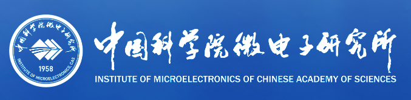
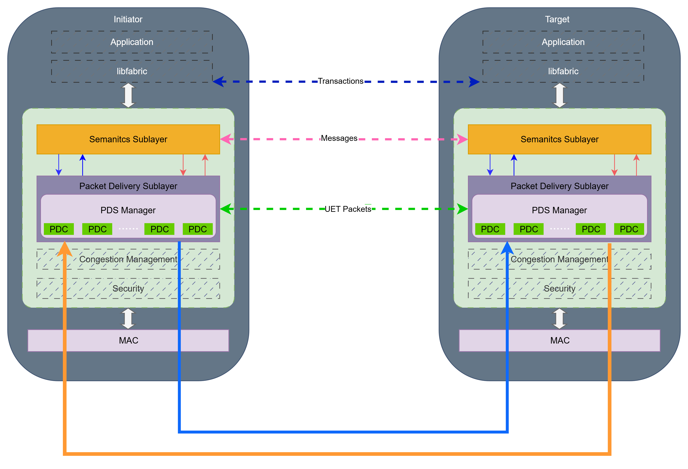
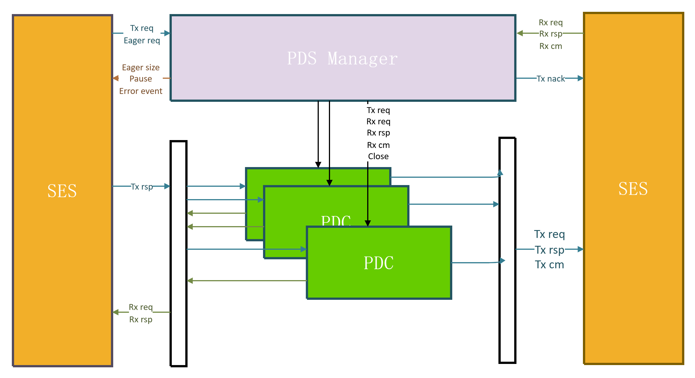

<div align="center">

## **UE-Sim: End-to-End Ultra Ethernet Simulation Platform**

<div align="center">

[](LICENSE)
[](VERSION)
[]()
[]()


<div align="center">
  <table>
    <tr>
      <td align="center" width="50%">
        <br/>
        <strong>Institute of Information Engineering</strong><br/>
        Chinese Academy of Sciences<br/>
        <em>State Key Laboratory of Cyberspace Security Defense</em>
      </td>
      <td align="center" width="50%">
        <br/>
        <strong>Institute of Microelectronics</strong><br/>
        Chinese Academy of Sciences<br/>
        <em>Artificial Intelligence Chip and System Research and Development Center</em>
      </td>
    </tr>
  </table>
</div>

</div>


</div>

## Table of Contents

- [UE-Sim Overview](#ue-sim-overview)
- [System Architecture](#system-architecture)
  - [Core Components](#core-components)
- [Repository Structure](#repository-structure)
- [Getting Started](#getting-started)
  - [Environment Requirements](#environment-requirements)
  - [Installation](#installation)
  - [Usage](#usage)
- [Changelog](#changelog)
- [Contributing](#contributing)
- [Contact us](#contact-us)
- [Citation](#citation)
- [License](#license)

---

## UE-Sim Overview

UE-Sim is an end-to-end network simulation platform for the [Ultra Ethernet(UE) Specification](https://ultraethernet.org/). 

Ultra Ethernet is a specification of new protocols for use over Ethernet networks and optional enhancements to existing Ethernet protocols that improve performance, function, and interoperability of AI and HPC applications. The Ultra Ethernet specification covers a broad range of software and hardware relevant to AI and HPC workloads: from the API supported by UE-compliant devices to the services offered by the transport, link, and physical layers, as well as management, interoperability, benchmarks, and compliance requirements. 

UE-Sim serves two primary objectives:

- **Network Configuration and Performance Evaluation**: UE-Sim provides a Ultra Ethernet platform for GPU manufacturers, AI computing center operators, and other users. It supports constructing topologies of various scales, configuring parameters, and evaluating network performance under different workloads.

- **Ultra Ethernet(UE) Specification Optimization**: The platform enables researchers to optimize Ultra Ethernet(UE) Specification through advancing algorithms and protocol validating. 

---

## System Architecture

<p align="center">
  
</p>

### Core Components

<p align="center">
  
</p>

- **SES (Semantic Sub-layer)**
  - Responsible for semantic processing of transaction requests, including endpoint addressing, authorization verification, and metadata management.
  - Implements **packet slicing (fragmentation)** functionality, breaking down large transactions into multiple packets suitable for network transmission (e.g., based on MTU).
  - Manages Message Sequence Numbers (MSN) for message boundary identification (SOM/EOM) and reassembly.

- **PDS (Packet Delivery Sub-layer)**
  - Acts as the central dispatcher for packet delivery.
  - Handles **PDC allocation and management**, assigning SES packets to specific Packet Delivery Contexts.
  - Performs packet routing, classification, and error handling for events not associated with a specific PDC.
  - Coordinates congestion control and traffic management policies.

- **PDC (Packet Delivery Context)**
  - Represents the transport context for a specific flow or transaction.
  - **IPDC (Immediate PDC)**: Provides unreliable, low-latency transmission for delay-sensitive traffic (no ACK/retransmission).
  - **TPDC (Transactional PDC)**: Provides reliable transmission with acknowledgment mechanisms and **Retransmission Timeout (RTO)** logic to ensure guaranteed delivery and ordering.

---

## Repository Structure

```
UE-Sim/
├── src/soft-ue/                      # UEC protocol stack implementation
│   ├── model/
│   │   ├── ses/                      # SES (Semantic Sub-layer)
│   │   │   ├── ses-header.h/cc      # SES packet header definition
│   │   │   ├── ses-packet.h/cc      # Packet slicing and fragmentation
│   │   │   └── ses-metadata.h/cc    # Message sequence number (MSN) management
│   │   ├── pds/                      # PDS (Packet Delivery Sub-layer)
│   │   │   ├── pds-dispatcher.h/cc  # Central packet dispatcher
│   │   │   ├── pds-allocator.h/cc   # PDC allocation and management
│   │   │   └── pds-router.h/cc      # Packet routing and classification
│   │   ├── pdc/                      # PDC (Packet Delivery Context)
│   │   │   ├── pdc-base.h/cc        # Base PDC interface
│   │   │   ├── ipdc.h/cc            # IPDC: Unreliable, low-latency transport
│   │   │   ├── tpdc.h/cc            # TPDC: Reliable transport with ACK
│   │   │   └── rto-timer.h/cc       # Retransmission timeout logic
│   │   ├── network/                  # ns-3 integration layer
│   │   │   ├── soft-ue-net-device.h/cc    # Network device implementation
│   │   │   ├── soft-ue-channel.h/cc       # Channel model
│   │   │   └── soft-ue-phy.h/cc           # Physical layer
│   │   └── common/                   # Shared utilities
│   │       ├── soft-ue-header.h/cc  # Common header definitions
│   │       ├── soft-ue-tag.h/cc     # Packet tags
│   │       └── soft-ue-queue.h/cc   # Queue management
│   ├── helper/                       # Helper classes for simulation setup
│   │   ├── soft-ue-helper.h/cc      # Main helper API
│   │   └── soft-ue-topology-helper.h/cc   # Topology configuration
│   └── test/                         # Unit and integration tests
│       ├── ses-test-suite.cc        # SES layer tests
│       ├── pds-test-suite.cc        # PDS layer tests
│       └── pdc-test-suite.cc        # PDC layer tests
│
├── scratch/                          # Example programs and experiments
│   ├── Soft-UE/                      # Throughput stress test
│   │   ├── stress-test.cc           # High-load performance testing
│   │   └── throughput-benchmark.cc  # Throughput measurement
│   └── Soft-UE-E2E-Concepts/         # End-to-end walkthrough
│       ├── uec-e2e-concepts.cc      # Protocol flow demonstration
│       └── basic-transmission.cc    # Simple send/receive example
│
├── examples/                         # Usage examples and tutorials
│   ├── first-soft-ue.cc             # Getting started example
│   ├── performance-benchmark.cc     # Performance testing suite
│   └── ai-network-simulation.cc     # AI workload simulation
│
├── benchmarks/                       # Performance benchmark suite
│   ├── soft-ue-performance-benchmark.cc   # Comprehensive benchmarks
│   └── e2e-demo-optimized.cc        # Real-world workload demos
│
├── docs/                             # Documentation
├── attachment/                       # Architecture diagrams
│   ├── SUETArchitecture.png
│   └── CoreComponents.png
├── CMakeLists.txt                    # Build configuration
├── ns3                               # ns-3 build script
├── README.md                         # This file
└── VERSION                           # Version: 1.0.0
```

**Key Directories:**
- **`src/soft-ue/model/`**: Core protocol implementation (SES, PDS, PDC layers)
- **`scratch/`**: Runnable test programs demonstrating key features
- **`examples/`**: Tutorial-style examples for users
- **`benchmarks/`**: Performance validation and comparison tests

---

## Getting Started

### Environment Requirements

- **Operating System**: Linux (Ubuntu 20.04.6 LTS)
- **Compilers**:
  - **GCC**: 10.1.0+
  - **Clang**: 11.0.0+
  - **AppleClang**: 13.1.6+ (macOS)
- **Build Tools**:
  - **CMake**: 3.13.0+ (Required)

### Installation

#### Step 1: Install System Dependencies

First, install the essential build tools and libraries:

```bash
sudo apt update
sudo apt install build-essential cmake git software-properties-common
```

#### Step 2: Check and Upgrade GCC Version

Check your current GCC version:

```bash
gcc --version
```

**If your GCC version is 10.1.0 or higher**, proceed to [Step 3](#step-3-clone-and-configure-UE-Sim).

**If your GCC version is below 10.1.0** (Ubuntu 20.04 default is 9.3.0), upgrade it:

```bash
# Add Ubuntu Toolchain PPA for newer GCC versions
sudo add-apt-repository ppa:ubuntu-toolchain-r/test
sudo apt update
# Install GCC 10 and G++ 10
sudo apt install gcc-10 g++-10
# Set GCC 10 as the default compiler
sudo update-alternatives --install /usr/bin/gcc gcc /usr/bin/gcc-10 100
sudo update-alternatives --install /usr/bin/g++ g++ /usr/bin/g++-10
```

#### Step 3: Clone and Configure UE-Sim

> **Important Note**: [This version of ns3 does not allow direct execution as root user](https://groups.google.com/g/ns-3-users/c/xDtfcaUrCwg?pli=1), please run the following commands as a regular user.

```
# Clone the project
git clone https://github.com/kaima2022/UE-Sim.git
cd UE-Sim

# Configure ns-3 environment
./ns3 configure --enable-examples --enable-tests
```

####  Step 4: Build 

```bash
./ns3 build
```

---

### Usage

UE-Sim supports end-to-end concept walkthroughs.

#### Concept Walkthrough Mode
Demonstrates the basic protocol interaction with annotated logs, illustrating the flow through SES (fragmentation), PDS (dispatch), and PDC:
```bash
./ns3 run uec-e2e-concepts -- --transactionSize=4000 --packetCount=2
```

---

## Changelog

### v1.0.0
- **Initial Release**:
  - Complete implementation of SES, PDS, and PDC layers.
  - Implemented SES packet segmentation/reassembly and metadata management.
  - Implemented PDS packet dispatching and PDC allocation logic.
  - Support for both IPDC (unreliable) and TPDC (reliable) transport contexts.

---

## Contributing

Contributions are welcome! Please feel free to submit a Pull Request.
- Use **GitHub Issues** for bug reports and feature requests.
- For code changes, submit a Pull Request with a runnable reproduction command if applicable.

---

## Contact us

For questions, suggestions, or bug reports, please feel free to contact us:

- **Project Email**: chasermakai@gmail.com

---

## Citation

If you find this project useful for your research, please consider citing it in the following format:

```bibtex
@software{UECSim,
  title   = {{UE-Sim: End-to-End Ultra Ethernet Simulation Platform}},
  url     = {https://github.com/kaima2022/uec-ns3},
  version = {v1.0.0},
  year    = {2025}
}
```

---

## License

GPLv2 License. See `LICENSE`.

---

<div align="center">

If you find this project helpful, please consider giving it a ⭐ star! Your support is greatly appreciated.

Made by the UE-Sim Project Team

</div>
