# Soft-UE 模块图表文档

## 1. 系统架构图

### 1.1 整体架构关系图

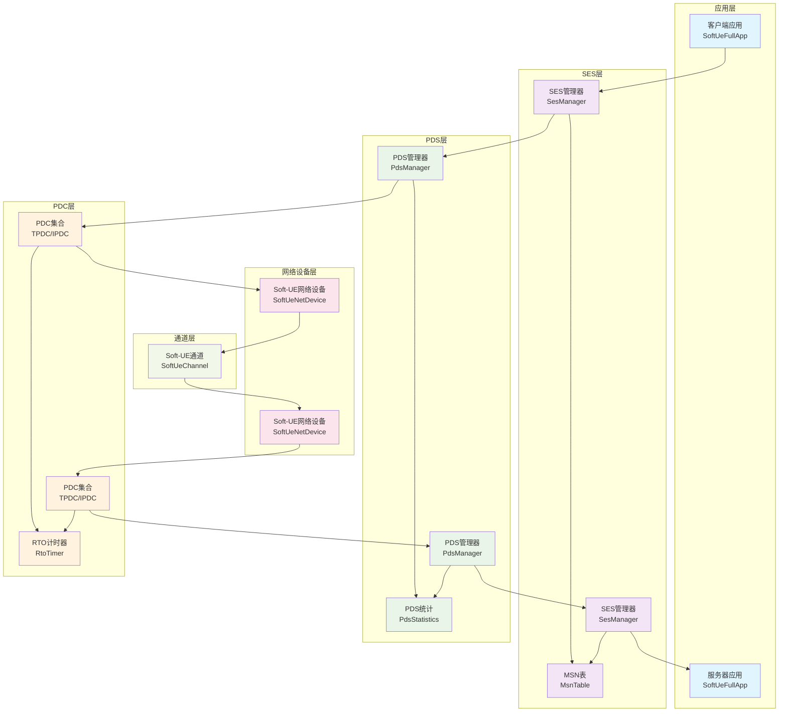

### 1.2 模块依赖关系图

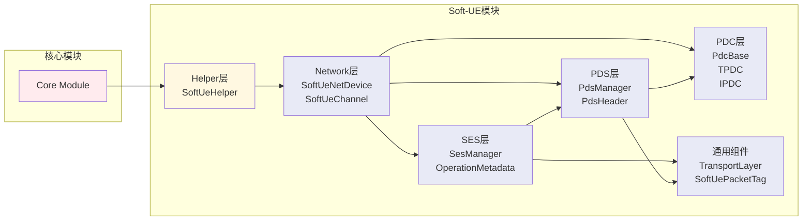

## 2. 点对点连接图

### 2.1 双节点点对点连接

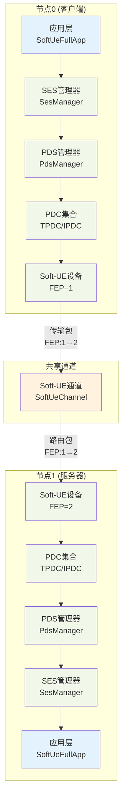

### 2.2 多节点连接拓扑

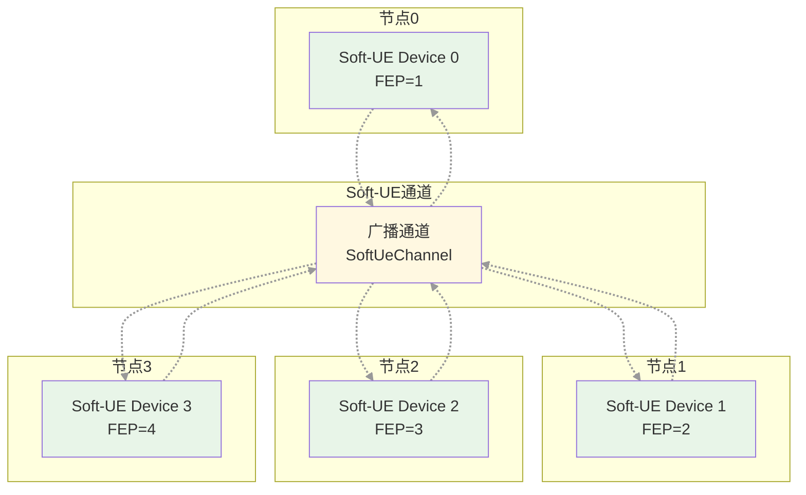

## 3. 时序图

### 3.1 端到端数据传输时序图

```mermaid
sequenceDiagram
    participant ClientApp as 客户端应用
    participant SESMgr as SES管理器
    participant PDSMgr as PDS管理器
    participant Device as Soft-UE设备
    participant Channel as Soft-UE通道
    participant ServerDevice as 服务器设备
    participant ServerApp as 服务器应用

    %% 发送流程
    Note over ClientApp,ServerApp: 数据包传输时序 (包 #N)

    ClientApp->>+ClientApp: 1. SendPacket()
    ClientApp->>+SESMgr: 2. ProcessSendRequest(metadata)
    SESMgr->>SESMgr: 3. Validate metadata
    SESMgr->>SESMgr: 4. Add MSN entry
    SESMgr->>+PDSMgr: 5. ProcessSesRequest(request)
    PDSMgr->>PDSMgr: 6. Validate request
    PDSMgr->>PDSMgr: 7. Create MAC address
    PDSMgr->>Device: 8. GetChannel()
    PDSMgr->>+Channel: 9. Transmit(packet, srcFEP, dstFEP)
    Channel->>Channel: 10. Calculate transmission delay
    Channel->>Channel: 11. ScheduleReceive()
    Channel-->>ServerDevice: 12. ReceivePacket() [delay]
    Channel-->>-PDSMgr: 13. Transmission complete
    PDSMgr-->>-SESMgr: 14. Request processed
    SESMgr-->>-ClientApp: 15. SES processed
    ClientApp->>+Device: 16. Send(packet, dest, protocol)
    ClientApp-->>-ClientApp: 17. m_packetsSent++
    ClientApp-->>-ClientApp: 18. ScheduleSend()

    %% 接收流程
    ServerDevice->>+ServerDevice: 19. ReceivePacket()
    ServerDevice->>ServerDevice: 20. Validate destFEP
    ServerDevice->>ServerDevice: 21. Add to receive queue
    ServerDevice->>ServerDevice: 22. Update statistics
    ServerDevice->>ServerDevice: 23. ProcessReceiveQueue()
    ServerDevice->>+ServerApp: 24. HandleRead()
    ServerApp->>ServerApp: 25. Remove PDS header
    ServerApp->>ServerApp: 26. Update counters
    ServerApp-->>-ServerDevice: 27. Return success
    ServerDevice-->>-ServerDevice: 28. Packet processed
```

### 3.2 管理器初始化时序图

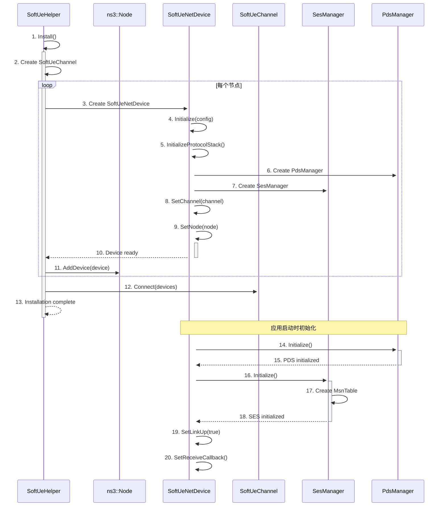

### 3.3 PDC生命周期时序图

```mermaid
sequenceDiagram
    participant App as 应用层
    participant SES as SES管理器
    participant PDS as PDS管理器
    participant PDC as PDC实例
    participant RTO as RTO计时器

    %% PDC创建
    App->>+SES: 1. ProcessSendRequest()
    SES->>SES: 2. Validate metadata
    SES->>+PDS: 3. ProcessSesRequest()
    PDS->>PDS: 4. Determine PDC type
    PDS->>+PDC: 5. Create TPDC
    PDC->>PDC: 6. Initialize sequence number
    PDC->>+RTO: 7. Start RTO timer
    RTO-->>-PDC: 8. Timer started
    PDC-->>-PDS: 9. PDC created
    PDS-->>-SES: 10. Request processed
    SES-->>-App: 11. SES processed

    %% 数据传输
    Note over App,RTO: PDC数据传输阶段
    PDS->>PDC: 12. Send packet
    PDC->>PDC: 13. Update statistics
    PDC->>RTO: 14. Reset RTO timer

    %% 确认接收
    Note over App,RTO: 可选：可靠传输确认
    PDS->>PDC: 15. Receive ACK
    PDC->>RTO: 16. Cancel RTO timer
    RTO-->>-PDC: 17. Timer cancelled
    PDC->>PDC: 18. Mark as delivered

    %% PDC销毁
    Note over App,RTO: 传输完成
    PDS->>PDC: 19. Destroy PDC
    PDC->>RTO: 20. Cancel any pending timer
    RTO-->>-PDC: 21. Timer cancelled
    PDC-->>-PDS: 22. PDC destroyed
```

## 4. 甘特图

### 4.1 开发里程碑甘特图

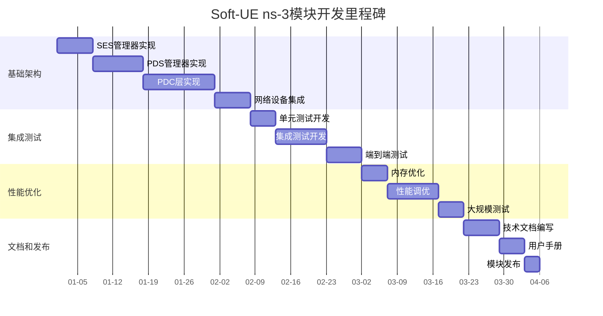

### 4.2 包传输处理时间甘特图

```mermaid
gantt
    title 单包传输处理时间线（单位：μs）
    dateFormat  X
    axisFormat  %sμs

    section 发送端处理
    应用层包创建        :a1, 0, 5μs
    SES元数据验证        :a2, after a1, 10μs
    PDS请求构建         :a3, after a2, 8μs
    设备层发送           :a4, after a3, 15μs

    section 网络传输
    通道传输延迟         :b1, after a4, 50μs
    目标设备接收         :b2, after b1, 10μs
    队列处理            :b3, after b2, 5μs

    section 接收端处理
    接收回调触发         :c1, after b3, 3μs
    包头解析            :c2, after c1, 12μs
    应用层处理           :c3, after c2, 8μs

    section 总时间
    端到端总时间         :milestone, 0, 126μs
```

## 5. 状态机图

### 5.1 包处理状态机

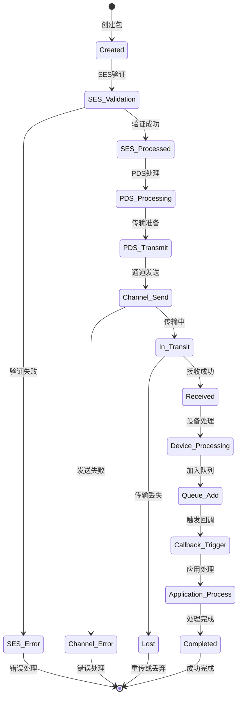

### 5.2 PDC状态机

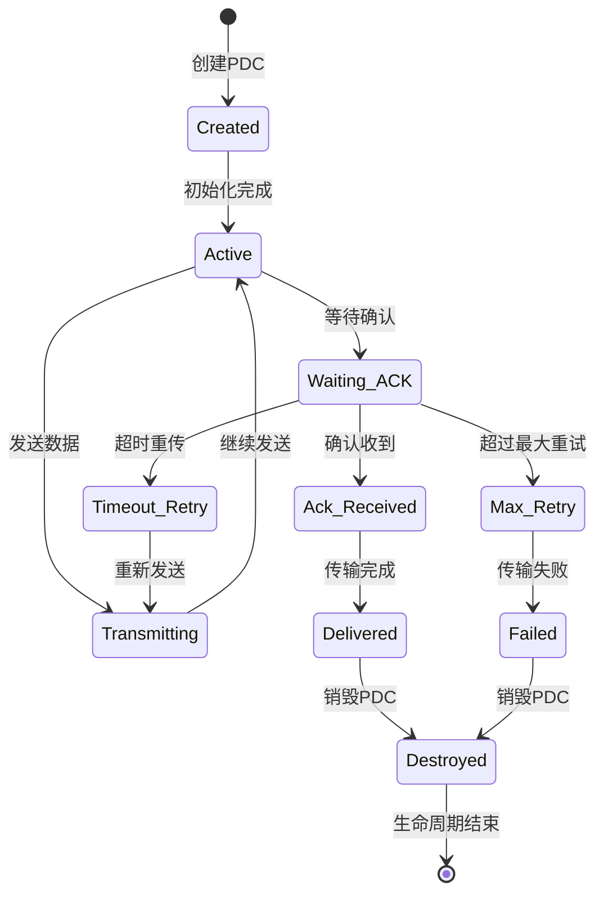

## 6. 类图

### 6.1 核心类关系图

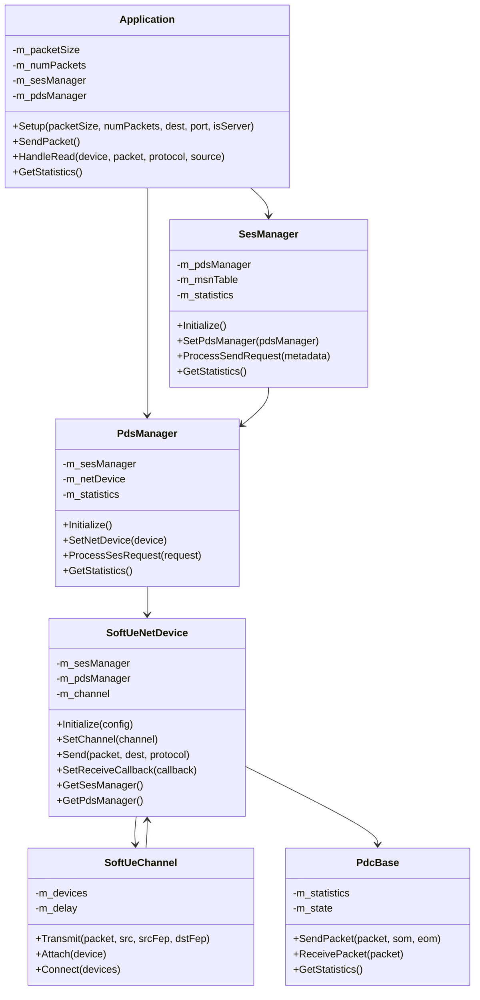

## 7. 部署图

### 7.1 ns-3集成部署图

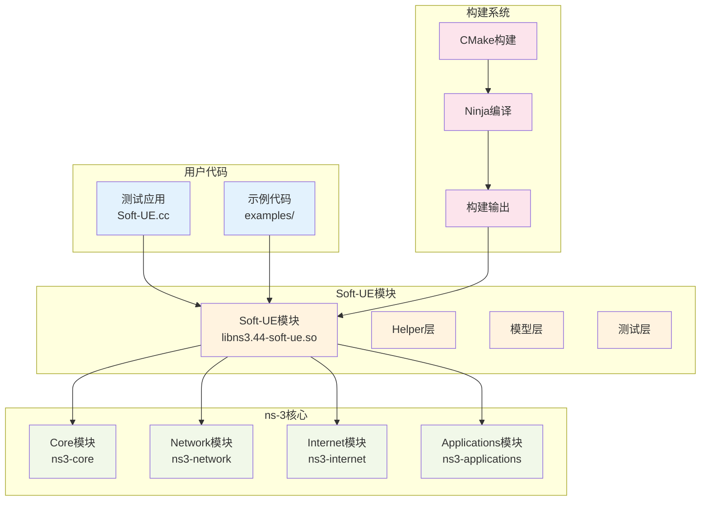

这些图表提供了Soft-UE系统的完整可视化表示，包括架构关系、时序流程、状态转换和类结构，为理解和维护系统提供了清晰的技术参考。